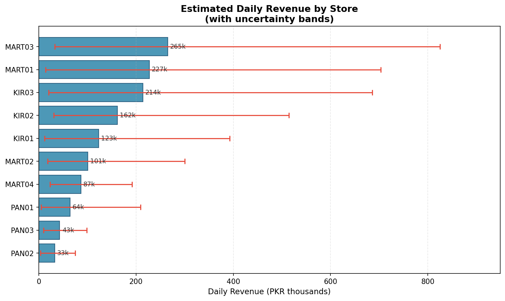

# Kiryana Daily Revenue Estimator

A field-data pipeline and interactive calculator for estimating the daily revenue of kiryana stores, pan shops, and mini marts. The project turns short transaction observations, basket values, operating hours, and inventory interviews into:

- low, base, and high daily-revenue scenarios;
- an independent inventory-based revenue cross-check;
- store-level results across repeat visits;
- sensitivity analysis for key model assumptions; and
- charts and a standalone browser calculator.

The included dataset contains 11 visit records across 10 stores.



## Method

The primary flow estimate is:

```text
hourly transaction rate = observed transactions × 60 / observation minutes
daily transactions      = hourly transaction rate / daypart factor × operating hours
average basket          = 60% observed basket + 40% owner-reported basket midpoint
base daily revenue      = daily transactions × average basket
```

When one basket source is unavailable, the model uses the available source or a store-type default. Low and high scenarios vary transaction volume and basket size.

The inventory cross-check estimates the sales represented by up to three top products:

```text
inventory revenue = Σ(restocks per day × quantity × selling price) / top-SKU share
```

By default, the model assumes the selected products represent 60% of revenue. It flags the two estimates as disagreeing when `inventory revenue / flow revenue` falls outside `0.7–1.4`. All assumptions are centralized in `CONSTANTS` near the top of `code files/model.py`.

## Requirements

- Python 3.10 or newer
- `pandas`
- `numpy`
- `matplotlib`
- Node.js (optional, only for the parity check)

Set up the Python environment from the repository root:

```bash
python3 -m venv .venv
source .venv/bin/activate
python -m pip install pandas numpy matplotlib
```

## Run the analysis

Run each command from the repository root.

```bash
# 1. Normalize the raw field data
python "code files/clean.py" \
  --raw data/raw_data.csv \
  --out clean_out

# 2. Calculate visit- and store-level revenue estimates
python "code files/model.py" \
  --clean_dir clean_out

# 3. Test the model's key assumptions
python "code files/sensitivity.py" \
  --clean_dir clean_out \
  --out_dir sensitivity_out

# 4. Regenerate the charts
python "code files/visualize.py" \
  --clean_dir clean_out \
  --out_dir data/charts
```

The cleaner records malformed or unusual values in the `issues` column rather than silently replacing them. The model follows the same pattern with its `flags` output.

## Use the interactive calculator

Open `model_ui.html` directly in a browser. It is a self-contained HTML/CSS/JavaScript application and does not require a server or build step.

Enter the store and observation details, optionally add at least two inventory items, and select **Estimate**. The **Load example: MART03** button fills in a complete sample.

To confirm that the JavaScript implementation remains aligned with the Python model, run:

```bash
node verify.js
```

The check compares four revenue outputs for five fixture visits and accepts a maximum difference of PKR 1.

## Outputs

| Path | Contents |
| --- | --- |
| `clean_out/visit_observations.csv` | Normalized visit-level observations |
| `clean_out/store_master.csv` | One row per store with stable attributes |
| `clean_out/model_results_per_visit.csv` | Revenue estimates and flags for each visit |
| `clean_out/model_results.csv` | Store-level estimates, averaged across repeat visits |
| `clean_out/validation.csv` | Reserved validation output schema |
| `sensitivity_out/per_visit.csv` | Visit-level results for each parameter perturbation |
| `sensitivity_out/summary.csv` | Aggregate sensitivity metrics |
| `data/charts/` | Generated revenue and triangulation charts |

## Repository structure

```text
.
├── code files/
│   ├── clean.py          # Raw CSV normalization and validation
│   ├── model.py          # Revenue estimator and store aggregation
│   ├── sensitivity.py    # Assumption perturbation analysis
│   └── visualize.py      # Chart generation
├── data/
│   ├── raw_data.csv      # Source field observations
│   ├── Photos/           # Field photos
│   └── charts/           # Generated figures
├── clean_out/            # Cleaned data and model results
├── sensitivity_out/      # Sensitivity results
├── model_ui.html         # Standalone interactive estimator
├── verify.js             # JavaScript/Python output parity check
└── Presentation Writeup.pdf
```

## Interpretation

These outputs are assumption-driven scenario estimates, not audited sales figures or predictive model results. Short observation windows, daypart adjustments, owner-reported baskets, and the assumed top-SKU share can materially affect the result. Use the uncertainty band, sensitivity output, triangulation ratio, and row-level flags together rather than treating the base estimate as a precise value.
